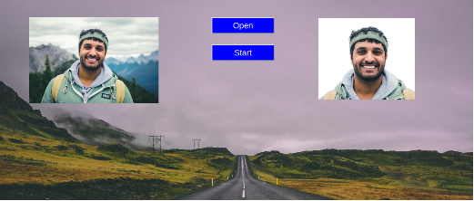

     &nbsp;
     
     &nbsp;

# Flask Image processing API

A deep learning approach to create passport size images by applying different deep learning method.

- Remove background from image
- fixed image orientation
- face alignment
- croping image from neck to top in specific ration
 footage**
 
 

## Sample results step by step

### Fixed orientation [In portrait]

<table>
<tr align="center">
<td><b>Before fixing orientation</b></td>
<td><b>After making in portrait</b></td>
</tr>
<tr align="center">
<td></td>
<td></td>
</tr>
<table>

### Face aligment

<table>
<tr align="center">
<td><b>Before fixing alignment</b></td>
<td><b>After fixing alignment</b></td>
</tr>
<tr align="center">
<td></td>
<td></td>
</tr>
<table>

### Background removing
<table>
<tr align="center">
<td><b>Before removing the background</b></td>
<td><b>After removing the background</b></td>
</tr>
<tr align="center">
<td></td>
<td></td>
</tr>
<table>

### Crop in passport size
<table>
<tr align="center">
<td><b>Before making passport size</b></td>
<td><b>After making passport size</b></td>
</tr>
<tr align="center">
<td></td>
<td></td>
</tr>
<table>

## Installation

### Python Version

- Python == 3.8

### Virtual Environment

#### Windows

- `python -m venv venv`
- `.\venv\Scripts\activate`
- If any problem for scripts activation
  - Execute following command in administration mode
    - `Set-ExecutionPolicy Unrestricted -Force`
  - Later you can revert the change
    - `Set-ExecutionPolicy restricted -Force`

#### Linux

- `python -m venv venv`
- `source venv/bin/activate`

### Library Installation

- Library Install
  - `tensorflow version 1.x`
  - `onnx`
  - `onnxruntime`
  - `mtcnn`

### Pretrained Weights Download
- download weight from referece project link.

## Inference

It will generate the output file in **temp/** folder

- `python inference.py ` 

## Reference

- [A Trimap-Free Solution for Portrait Matting in Real Time under Changing Scenes](https://github.com/ZHKKKe/MODNet)

- Smile detection using keras [Smiler](https://github.com/sarvasvkulpati/Smiler)

- Pose estimation and matching with TensorFlow lite PoseNet model. [Link](https://medium.com/roonyx/pose-estimation-and-matching-with-tensorflow-lite-posenet-model-ea2e9249abbd)

- Sample Female photo by <a href="https://unsplash.com/@lureofadventure">Ali Kazal</a> on <a href="https://unsplash.com/photos/mpPfqvh04Fc">Unsplash</a>
